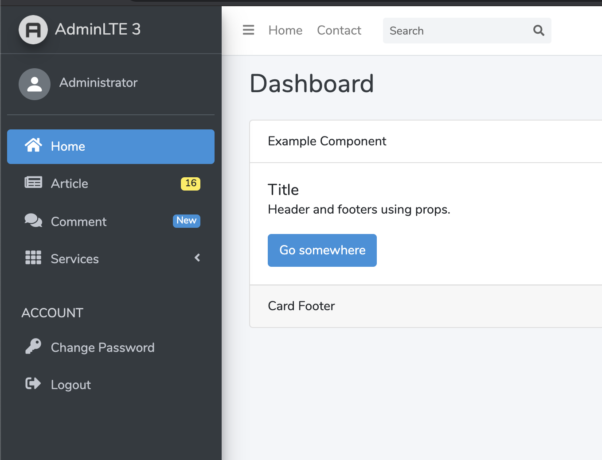

# Welcome to Laravel Menu!

Generate multi navigation menus with unique names, can be displayed anywhere. Custom templating. Support Laravel 5, 6, 7.



------

## Installation

#### <i class="icon-file"></i> Installation with Composer

Simply execute the following command

```
composer require nurmanhabib/laravel-menu
```


#### <i class="icon-file"></i> Register Service Provider and Facade

Add `Nurmanhabib\LaravelMenu\MenuServiceProvider` to the file in `config/app.php` in array with key `providers`.

```php
'providers' => [
    ...,
    ...,
    
    Nurmanhabib\LaravelMenu\MenuServiceProvider::class,
],
```


Add `Nurmanhabib\LaravelMenu\Facades\Menu` to the file in `config/app.php` in array with key `aliases`.


```php
'aliases' => [
    ...,
    ...,
  
    'Menu' => Nurmanhabib\LaravelMenu\Facades\Menu::class,
],
```

------

## Quick Example

You can create in the routes files, middleware, or service providers that you custom yourself as needed.

```php
<?php

Menu::make('sidebar', function ($menu) {
    Menu::link('Home', 'home')->setIcon('fas fa-home');
    Menu::link('Article', 'articles')->setIcon('fas fa-newspaper')
        ->setData([
            'badge' => [
                'type' => 'warning',
                'text' => '16'
            ]
        ]);

    Menu::link('Comment', 'comments')->setIcon('fas fa-comments')
        ->setData([
            'badge' => [
                'type' => 'primary',
                'text' => 'New'
            ]
        ]);

    Menu::dropdown('Services', function () {
        Menu::link('Service 1', 'services/one');
        Menu::link('Service 2', 'services/two');
    });

    Menu::heading('Account');

    Menu::link('Change Password')->setIcon('fas fa-key');
    Menu::logout()->setIcon('fas fa-sign-out-alt');
});

```


```php
<?php

Menu::make('account', function () {
    Menu::link('Me', 'me', 'view-dashboard');

    Menu::separate();

    Menu::link('Change Password', url('change-password'), 'view-dashboard');
    Menu::logout();
    
    // Alternative to
    // Menu::link('Logout', 'logout', 'signout')->setData(['method' => 'POST']);
});
```


### Make From Array

You might be able to make it from another data source (for example: a database) and then process it into array data and turn it into a menu.

```php
<?php

$items = [
     [
         'text' => 'Home',
         'url' => '/'
     ],
     [
         'text' => 'Berita',
         'url' => 'berita',
         'match' => '/berita*'
     ],
     [
         'type' => 'separator'
     ],
     [
         'text' => 'Kategori',
         'child' => [
             [
                 'text' => 'Teknologi',
                 'url' => 'kategori/teknologi'
             ],
             [
                 'text' => 'Otomotif',
                 'url' => 'kategori/otomotif'
             ],
             [
                 'text' => 'Lifestyle',
                 'child' => [
                     [
                         'text' => 'Pria',
                         'url' => 'lifestyle-pria'
                     ],
                     [
                         'text' => 'Wanita',
                         'url' => 'lifestyle-wanita'
                     ],
                 ]
             ],
         ]
     ],
     [
         'type' => 'heading',
         'text' => 'Configuration'
     ],
     [
         'text' => 'Account',
         'child' => [
             [
                 'text' => 'Change Password',
                 'url' => 'change-password'
             ],
             [
                 'text' => 'Logout',
                 'url' => 'logout'
             ],
         ]
     ],
 ];

Menu::makeFromArray('sidebar', $items);

// or

Menu::make('sidebar', function () use ($items) {
    Menu::arrays($items);
});

```


#### Set View

```php
Menu::get('sidebar')->setView('admin-lte');
```


#### Render to View

```html
{!! Menu::get('sidebar') !!}
```


You can also call with the `menu()` helpers


```html
{!! menu()->get('sidebar') !!}
```

or

```html
{!! menu('sidebar') !!}
```


## Custom View

To be able to customize the navigation with view

```php
Menu::get('sidebar')->setView('view.name');
```

Available default views:

```php
'views' => [
    'simple' => 'menus::simple.menu',
    'bs-nav-stacked' => 'menus::bs-nav-stacked.menu',
    'sbadmin2' => 'menus::sbadmin2.menu',
    'adminto' => 'adminto::menus.sidebar.menu',
    'admin-lte' => 'menus::admin-lte.menus',
]
```

Then you can customize `view.name` and receive `$menu` variable `Nurmanhabib\Navigator\NavCollection`

```html
<ul>
  @foreach ($menu->getItems() as $item)
    @if ($item->getType() == 'heading')
      <li class="text-muted">{{ $item->getText() }}</li>
    @elseif ($item->getType() == 'separator')
      <li class="text-muted">---</li>
    @else
      @if ($item->hasChild())
        <li class="has_sub">
          <a href="javascript:void(0)">
            <i class="={{ $item->getIcon() }}"></i> {{ $item->getText() }}
            <span class="menu-arrow"></span>
          </a>
          
          @include('view.name', ['menu' => $item->getChild()])
        </li>
      @else
        @if ($item->isActive())
          <li class="active">
            <a href="{{ $item->getUrl() }}">
              <i class="{{ $item->getIcon() }}"></i> {{ $item->getText() }}
            </a>
          </li>
        @else
          <li>
            <a href="{{ $item->getUrl() }}">
              <i class="{{ $item->getIcon() }}"></i> {{ $item->getText() }}
            </a>
          </li>
        @endif
      @endif
    @endif
  @endforeach
</ul>
```


## Custom Renderer

```php
use Nurmanhabib\LaravelMenu\Renders\NavViewRender;

Menu::get('sidebar')->setRenderer(new NavViewRender('view.name'));
```

------

### API

#### Nav

```php
$nav->getText();
$nav->getUrl();
$nav->getIcon();
$nav->isActive();
$nav->isVisible();
$nav->hasChild();
$nav->getChild();
```


#### NavCollection

```php
$collection->addHeading();
$collection->addHome();
$collection->addSeparator();
$collection->addLink('Text', 'link', 'icon');
$collection->addParent('Text Parent', callback($child), 'icon', '#');
$collection->add($nav);
$collection->getItems();
```

## Contributing

I apologize if the documentation is still not perfect, if you are willing to contribute to the documentation please do a Pull Request. We also feel happy if we want to contribute to open source.
